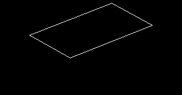

# Cuboid Detector
3D Reconstruction of a cuboid from an RGB image.
### How to run
1. Install requirements with:  
    <code>pip install -r requirements.txt</code>
2. Run the script with:  
    <code>python cuboid_detector.py</code>  

### Pipeline
Cuboid RGB image:  
  
Cuboid grayscale image:  
  
Edges:  
  
Lines computed from edges:  
  
Cuboid surfaces from lines:  
  
  
  
Final computed cuboid points:  
  
Reconstructed cuboid:  
  
